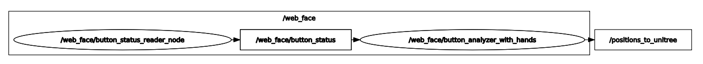
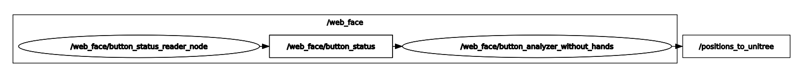

# unitree_h1_point-by-point_programming

Данный репозиторий содержит ROS2-пакеты для программирования движений робота Unitree H1 по точкам. Система предоставляет инструменты для записи, воспроизведения последовательностей поз (макросов) и управления через веб-интерфейс. Поддерживаются конфигурации как с манипуляторами Inspire Hands, так и без них.

## 📚 Оглавление

1. [📦 Содержание репозитория](#-содержание-репозитория)
2. [🚀 Быстрый старт](#-быстрый-старт)
3. [⚙️ Предварительные требования](#️-предварительные-требования)
4. [🧪 Использование](#-использование)
   - 4.1 [Запись движений](#-запись-движений)
   - 4.2 [Воспроизведение макросов](#-воспроизведение-макросов)
   - 4.3 [Веб-управление](#-веб-управление)
5. [📡 Интерфейс (топики, сервисы, параметры)](#-интерфейс-топики-сервисы-параметры)
   - 5.1 [Пакет 1: `button_analyzer`](#пакет-1-button_analyzer)
   - 5.2 [Пакет 2: `buttons_server`](#пакет-2-buttons_server)
   - 5.3 [Пакет 3: `position_reader`](#пакет-3-position_reader)
   - 5.4 [Пакет 4: `position_writer`](#пакет-4-position_writer)
   - 5.5 [Пакет 5: `macros_writer`](#пакет-5-macros_writer)
6. [🌐 RQT-grahs's](#️-rqt-grahss)
7. [🧐 Лицензия](#-лицензия)
8. [💡 Предложения и корректировки](#-предложения-и-корректировки)

---

## 📦 Содержание репозитория

*   **`button_analyzer/`**: Основной узел воспроизведения макросов. Читает команды от веб-интерфейса, загружает соответствующие файлы-макросы и публикует последовательность поз для робота.
*   **`buttons_server/`**: Веб-сервер на Flask предоставляет REST API и интерфейс управления кнопками. Отслеживает состояние кнопок и публикует активные команды.
*   **`completed_scripts_point-by-point_programming/`**: Содержит launch-файлы для запуска полной конфигурации системы веб-управления.
*   **`docs/`**: Дополнительная документация.
*   **`position_reader/`**: Узел для чтения и воспроизведения одиночных поз из файла с проверкой достижения целевых положений.
*   **`position_writer/`**: Приложение с GUI (Tkinter) для интерактивной записи поз робота в файл.
*   **`macros_writer/`**: Утилита для записи потока поз в файл для создания макросов.
*   **`install_dependensies.bash`**: Скрипт для установки системных и Python-зависимостей.
*   **`LICENSE`**: Лицензия MIT.

<p align="right" style="margin-top: 20px;"><a href="#-оглавление" style="text-decoration: none;">🔝 Вернуться к оглавлению</a></p>

## 🚀 Быстрый старт

Предполагается, что базовый workspace управления Unitree H1 (`unitree_h1_control_ws`) уже собран и проинициализирован.

1.  **Клонировать репозиторий** в `src` вашего workspace:
```bash
mkdir -p unitree_h1_point-by-point_programming_ws/src 
cd unitree_h1_point-by-point_programming_ws/src
git clone https://github.com/cyberbanana777/unitree_h1_point-by-point_programming_ws.git .
```

2.  **Установить зависимости:**
```bash
sudo bash ./install_dependensies.bash
```

3.  **Собрать workspace:**
```bash
cd ..
colcon build 
source install/local_setup.bash
```

4. **Добавить `source` в `~/.bashrc`:**
Зачем? - Чтобы не делать при каждом перезапуске терминала `source install/local_setup.bash`. Скрипт генерирует строчку для автоматизации этого процесса.
```bash
line_to_add="source \"$(pwd)/install/local_setup.bash\""
grep -qxF "$line_to_add" ~/.bashrc || echo "$line_to_add" >> ~/.bashrc
```

5.  **Запустить систему веб-управления** (выберите конфигурацию):
```bash
# С манипуляторами Inspire Hands
ros2 launch completed_scripts_point-by-point_programming control_by_buttons.launch.py

# Без манипуляторов Inspire Hands
ros2 launch completed_scripts_point-by-point_programming control_by_buttons.launch.py mode:=without_hands
```

6.  **Открыть веб-интерфейс**:
    Перейдите по адресу `http://<IP_ВАШЕГО_РОБОТА>:5000` в браузере.

<p align="right" style="margin-top: 20px;"><a href="#-оглавление" style="text-decoration: none;">🔝 Вернуться к оглавлению</a></p>

## ⚙️ Предварительные требования

*   **Версия ROS2:** Foxy
*   **ОС:** Ubuntu 20.04
*   **Ключевые ROS2 пакеты:** `rclpy`, `std_msgs`, `geometry_msgs`, `unitree_go`
*   **Python-зависимости:** `numpy(pip)`, `flask(pip)`, `requests(pip)`, `tkinter(pip)`

<p align="right" style="margin-top: 20px;"><a href="#-оглавление" style="text-decoration: none;">🔝 Вернуться к оглавлению</a></p>

## 🧪 Использование

### **Запись движений**

#### Использование GUI (position_writer)
```bash
ros2 run position_writer position_writer_node
```
После запуска введите имя файла для сохранения поз. Появится окно с кнопками:
- **Record Pose**: Записать текущую позу
- **Delete Last**: Удалить последнюю записанную позу
- **Restore Last**: Восстановить последнюю удаленную позу

#### Использование утилиты (macros_writer)
```bash
ros2 run macros_writer macros_writer
```
Введите имя макроса и абсолютный путь для сохранения. Утилита начнет записывать все сообщения из топика `positions_to_unitree` в файл.

### **Воспроизведение макросов**

#### Воспроизведение отдельной позы
```bash
ros2 run position_reader position_reader_node --ros-args -p file_name:=pose_test
```

#### Воспроизведение через веб-интерфейс
Запустите соответствующую launch-конфигурацию и откройте веб-интерфейс.

### **Веб-управление**

После запуска launch-файла откройте в браузере `http://<IP_РОБОТА>:5000`.

```bash
# С манипуляторами Inspire Hands
ros2 launch completed_scripts_point-by-point_programming control_by_buttons.launch.py

# Без манипуляторов Inspire Hands
ros2 launch completed_scripts_point-by-point_programming control_by_buttons.launch.py mode:=without_hands
```

**Доступные макросы (с руками):**
- Wave hand (Помахать)
- Take photo (Сфотографировать)
- Attention please (Привлечь внимание)
- Selfie (Селфи)
- Offer hand (Протянуть руку)
- Shake hand (Пожать руку)
- Accept documents (Принять документы)
- Take documents (Взять документы)
- Hold documents (Держать документы)
- Give documents (Передать документы)
- Release documents (Освободить документы)

**Доступные макросы (без рук):**
- Selfie
- Wave hand
- Attention please
- Take photo

<p align="right" style="margin-top: 20px;"><a href="#-оглавление" style="text-decoration: none;">🔝 Вернуться к оглавлению</a></p>

## 📡 Интерфейс (топики, сервисы, параметры)

### **Пакет 1: `button_analyzer`**

#### **Узел: `button_analyzer_with_hands_node` / `button_analyzer_without_hands_node`**

- **Подписки:**

| Топик | Тип сообщения | Описание |
|-------|---------------|----------|
| `button_status` | `std_msgs/String` | Состояние активной кнопки от веб-сервера |

- **Публикации:**

| Топик | Тип сообщения | Описание |
|-------|---------------|----------|
| `positions_to_unitree` | `std_msgs/String` | Позы для робота в формате `JSON$impact` |

- **Параметры:** Отсутствуют

### **Пакет 2: `buttons_server`**

#### **Узел: `hear_server_node`**

- **Подписки:** Отсутствуют
- **Публикации:**
  | Топик | Тип сообщения | Описание |
  |-------|---------------|----------|
  | `button_status` | `std_msgs/String` | ID активной кнопки или `None` |

- **Параметры:**
  | Параметр | Тип/Значение | Описание |
  |----------|--------------|----------|
  | `SERVER_URL` | `http://localhost:5000` | Адрес Flask-сервера |
  | `MONITOR_RATE` | `20.0 Hz` | Частота опроса сервера |

#### **Сервер: `server_stand_up_with_hands` / `server_stand_up_without_hands`**
- **HTTP API (port 5000):**
  - `GET /` - Веб-интерфейс управления
  - `GET /activate?btn=<name>&active=true/false` - Активация/деактивация кнопки
  - `GET /api/status` - Текущее состояние кнопок
  - `GET /api/get_state` - Полное состояние с историей

### **Пакет 3: `position_reader`**

#### **Узел: `position_reader_node`**

- **Подписки:**
  | Топик | Тип сообщения | Описание |
  |-------|---------------|----------|
  | `lowstate` | `unitree_go/LowState` | Состояние основных моторов |
  | `wrist/states` | `unitree_go/MotorStates` | Состояние моторов кистей |
  | `inspire/state` | `unitree_go/MotorStates` | Состояние пальцев Inspire |

- **Публикации:**
  | Топик | Тип сообщения | Описание |
  |-------|---------------|----------|
  | `positions_to_unitree` | `std_msgs/String` | Целевые позы для робота |

- **Параметры:**
  | Параметр | Тип/Значение | Описание |
  |----------|--------------|----------|
  | `file_name` | `string (pose_test)` | Имя файла с позами |

### **Пакет 4: `position_writer`**

#### **Узел: `position_writer_node`**

- **Подписки:**
  | Топик | Тип сообщения | Описание |
  |-------|---------------|----------|
  | `positions_to_unitree` | `std_msgs/String` | Входящие позы для записи |

- **Публикации:** Отсутствуют
- **Параметры:** Отсутствуют

### **Пакет 5: `macros_writer`**

#### **Узел: `macros_writer_node`**

- **Подписки:**
  | Топик | Тип сообщения | Описание |
  |-------|---------------|----------|
  | `positions_to_unitree` | `std_msgs/String` | Входящие позы для записи |

- **Публикации:** Отсутствуют
- **Параметры:** Отсутствуют

<p align="right" style="margin-top: 20px;"><a href="#-оглавление" style="text-decoration: none;">🔝 Вернуться к оглавлению</a></p>

## 🌐 RQT-grahs's
Все зависимости представленны в виде `пакет -> испольняемый файл`

### `control_by_buttons.launch.py`
Запускает полную систему веб-управления с поддержкой манипуляторов:
- `buttons_server -> server_stand_up_with_hands` - Веб-сервер с 11 кнопками
- `buttons_server -> hear_server_node` - Мониторинг состояния кнопок
- `button_analyzer -> button_analyzer_with_hands_node` - Воспроизведение макросов


### `control_by_buttons.launch.py mode:=without_hands`
Запускает систему веб-управления без манипуляторов:
- `buttons_server -> server_stand_up_without_hands` - Веб-сервер с 4 кнопками
- `buttons_server -> hear_server_node` - Мониторинг состояния кнопок
- `button_analyzer -> button_analyzer_without_hands_node` - Воспроизведение макросов


<p align="right" style="margin-top: 20px;"><a href="#-оглавление" style="text-decoration: none;">🔝 Вернуться к оглавлению</a></p>

## 🧐 Лицензия
Copyright (c) 2025 Алиса Зенина и Александр Грачев РТУ МИРЭА (Россия)

Данное программное обеспечение распространяется под [лицензией MIT](LICENSE).  
Разрешается свободное использование, копирование, модификация и распространение при условии сохранения уведомления об авторских правах и текста лицензии.

<p align="right" style="margin-top: 20px;"><a href="#-оглавление" style="text-decoration: none;">🔝 Вернуться к оглавлению</a></p>

## 💡 Предложения и корректировки
Если Вы нашли, ошибку, неточность, у Вас есть предложения по улучшению или вопросы, то напишите в телеграмм [сюда](https://t.me/Alex_19846) (Александр) или [сюда](https://t.me/Kika_01) (Алиса).

<p align="right" style="margin-top: 20px;"><a href="#-оглавление" style="text-decoration: none;">🔝 Вернуться к оглавлению</a></p>
